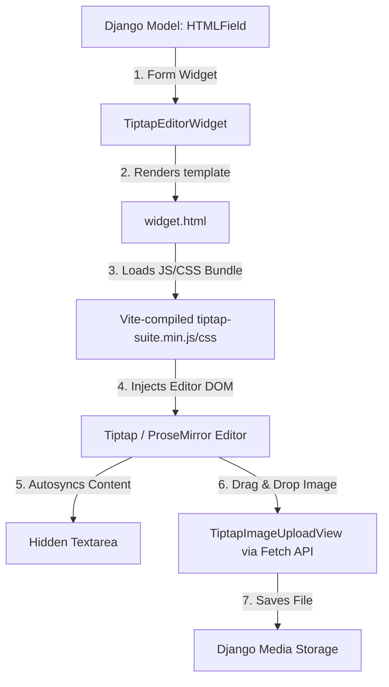

# Getting Started: Step-by-Step Integration Guide

This guide walks you through installing, configuring, and using `django-tiptap-suite` in a Django project from scratch.

---

## Architecture: How it Works Under the Hood

Before we start, it helps to understand how the components fit together:



1. **The Python Layer**: `HTMLField` behaves exactly like a Django `TextField` but defaults to using the `TiptapEditorWidget` as its widget.
2. **The HTML/CSS/JS Bundle**: The widget renders a hidden textarea (used for form submission) and a container where our JavaScript bundle initializes the headless Tiptap editor.
3. **Real-time Sync**: As you write in the editor, Tiptap's event listener instantly updates the hidden textarea's value. When the form is submitted, Django processes it like any standard form POST.
4. **Image Uploads**: Dropping or selecting an image fires a POST request to a dedicated Django view (`TiptapImageUploadView`). This view saves the image to your media storage and returns the URL to the editor, inserting the image inline.

---

## Step-by-Step Implementation

### Step 1: Install the Package
First, install the package from PyPI:

```bash
pip install django-tiptap-suite
```

Ensure you also have `Pillow` installed (which is a dependency for image handling):
```bash
pip install pillow
```

### Step 2: Configure Django settings
In your project's `settings.py`, add `django_tiptap_suite` to your `INSTALLED_APPS`:

```python
# settings.py

INSTALLED_APPS = [
    # ...
    "django.contrib.staticfiles",
    "django_tiptap_suite",
    # ...
]
```

#### Media Files Configuration (For Image Uploads)
Because the editor supports image uploads, make sure you have defined `MEDIA_URL` and `MEDIA_ROOT` in your `settings.py`:

```python
# settings.py

MEDIA_URL = "/media/"
MEDIA_ROOT = os.path.join(BASE_DIR, "media")
```

### Step 3: Set up URLs
Add the package urls to your main `urls.py` routing. This registers the image upload endpoints and serves the uploaded files during development:

```python
# urls.py

from django.contrib import admin
from django.urls import path, include
from django.conf import settings
from django.conf.urls.static import static

urlpatterns = [
    path("admin/", admin.site.urls),
    # Register the tiptap upload URLs
    path("tiptap/", include("django_tiptap_suite.urls", namespace="django_tiptap_suite")),
]

# Serve media files in development
if settings.DEBUG:
    urlpatterns += static(settings.MEDIA_URL, document_root=settings.MEDIA_ROOT)
```

### Step 4: Use in Models
Declare the `HTMLField` in your models. This field automatically handles rich HTML content:

```python
# models.py

from django.db import models
from django_tiptap_suite.fields import HTMLField

class Document(models.Model):
    title = models.CharField(max_length=200)
    body = HTMLField(blank=True, default="")
    created_at = models.DateTimeField(auto_now_add=True)

    def __str__(self):
        return self.title
```

Create and run the migrations:
```bash
python manage.py makemigrations
python manage.py migrate
```

### Step 5: Register in Django Admin
Register your model in the admin panel. The field will automatically render the Tiptap editor instead of the default plain textarea:

```python
# admin.py

from django.contrib import admin
from .models import Document

@admin.register(Document)
class DocumentAdmin(admin.ModelAdmin):
    list_display = ("title", "created_at")
```

Now, launch your development server:
```bash
python manage.py runserver
```
Visit `/admin/` to write with the Notion-like editor!

---

## Customization & Configuration

You can globally customize the behavior of the editor by adding `TIPTAP_SUITE_CONFIG` to your `settings.py`:

```python
# settings.py

TIPTAP_SUITE_CONFIG = {
    # Custom placeholder text when the editor is empty
    "placeholder": "Type '/' for commands or start writing...",
    
    # Choose which extensions to enable. Remove items to disable features.
    "enabled_extensions": [
        "bold", "italic", "underline", "strike", "heading",
        "bulletList", "orderedList", "blockquote", "codeBlock",
        "link", "image", "textAlign", "table", "taskList"
    ],
    
    # Disable the "/" popover menu entirely if set to True
    "disable_slash_commands": False,
    
    # Styling options
    "inject_css": True,                 # Auto-injects CSS styles on str(HTMLField) evaluation
    "css_class": "tiptap-content",      # The wrapper CSS class used when rendering HTML
    
    # Image uploads settings
    "image_upload_path": "tiptap_uploads/%Y/%m",  # Directory structure for uploads
    "image_max_size": 5 * 1024 * 1024,             # Max file size in bytes (e.g., 5MB limit)
}
```

---

## Rendering Content in Frontend Templates

When displaying the saved HTML content in your public-facing frontend templates, keep in mind:

1. **Security**: By default, Django escapes HTML to prevent XSS. You must use the `|safe` filter to render the HTML markup.
2. **Styling**: Since the editor is headless, the output HTML doesn't come with CSS. To make it look identical to the editor's design, wrap your output in a container with a class (e.g., `tiptap-content`) and apply matching typography rules:

### Template Example:
```html
<!-- document_detail.html -->



  <h1>{{ document.title }}</h1>
  
  <!-- Wrap the HTML content in the tiptap-content class -->
  <div class="tiptap-content">
    {{ document.body|safe }}
  </div>

```

### Recommended Stylesheet for Your Public Frontend:
Add this CSS block to your public site's stylesheet to render the output with beautiful, clean Notion-like typography and layouts:

```css
/* Public frontend styling for Tiptap generated HTML */
.tiptap-content {
  font-family: -apple-system, BlinkMacSystemFont, "Segoe UI", Roboto, Helvetica, Arial, sans-serif;
  color: #37352f;
  line-height: 1.65;
  font-size: 16px;
}

.tiptap-content p {
  margin: 0 0 0.8rem 0;
}

.tiptap-content h1, .tiptap-content h2, .tiptap-content h3 {
  font-weight: 600;
  margin-top: 1.8rem;
  margin-bottom: 0.6rem;
  color: #111111;
}

.tiptap-content h1 { font-size: 2rem; }
.tiptap-content h2 { font-size: 1.5rem; }
.tiptap-content h3 { font-size: 1.25rem; }

.tiptap-content blockquote {
  border-left: 3px solid rgba(55, 53, 47, 0.3);
  padding: 0.5rem 1rem;
  margin: 1rem 0;
  background-color: rgba(55, 53, 47, 0.03);
  color: rgba(55, 53, 47, 0.8);
}

.tiptap-content pre {
  background-color: #272822;
  color: #f8f8f2;
  padding: 1rem;
  border-radius: 6px;
  overflow-x: auto;
  font-family: monospace;
}

.tiptap-content :not(pre) > code {
  background-color: rgba(135, 131, 120, 0.15);
  color: #eb5757;
  padding: 0.2rem 0.4rem;
  border-radius: 4px;
}

.tiptap-content ul {
  list-style-type: disc;
  margin-left: 1.5rem;
}

.tiptap-content ol {
  list-style-type: decimal;
  margin-left: 1.5rem;
}

.tiptap-content img {
  max-width: 100%;
  height: auto;
  border-radius: 6px;
}

/* Alignments */
.tiptap-content [style*="text-align: right"] { text-align: right; }
.tiptap-content [style*="text-align: center"] { text-align: center; }
.tiptap-content [style*="text-align: justify"] { text-align: justify; }
.tiptap-content [style*="text-align: left"] { text-align: left; }

/* Tables styling */
.tiptap-content table {
  border-collapse: collapse;
  table-layout: fixed;
  width: 100%;
  margin: 1rem 0;
  overflow: hidden;
}

.tiptap-content td, .tiptap-content th {
  min-width: 1em;
  border: 1px solid rgba(55, 53, 47, 0.16);
  padding: 6px 8px;
  vertical-align: top;
  box-sizing: border-box;
}

.tiptap-content th {
  font-weight: 600;
  text-align: left;
  background-color: rgba(55, 53, 47, 0.03);
}

/* Task lists styling */
.tiptap-content ul[data-type="taskList"] {
  list-style: none !important;
  padding: 0 !important;
  margin-left: 0.5rem !important;
}

.tiptap-content ul[data-type="taskList"] li {
  display: flex !important;
  align-items: flex-start;
  margin-bottom: 0.25rem !important;
}

.tiptap-content ul[data-type="taskList"] li > label {
  margin-right: 0.5rem;
  user-select: none;
  display: inline-flex;
  align-items: center;
  padding-top: 4px;
}

.tiptap-content ul[data-type="taskList"] li > div {
  flex: 1;
}
```
